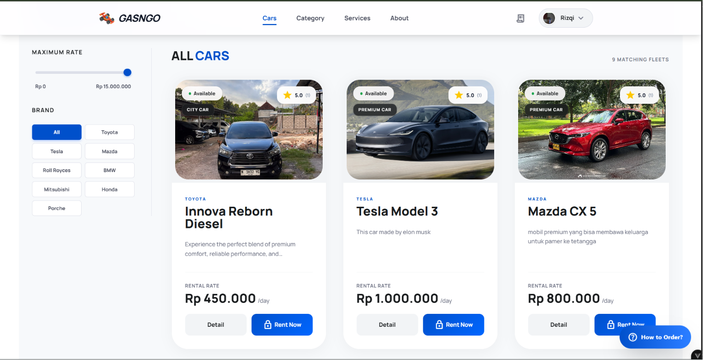
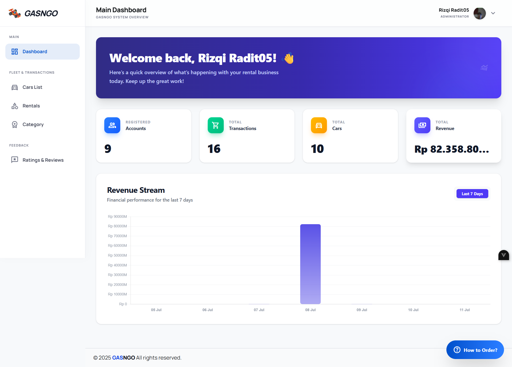
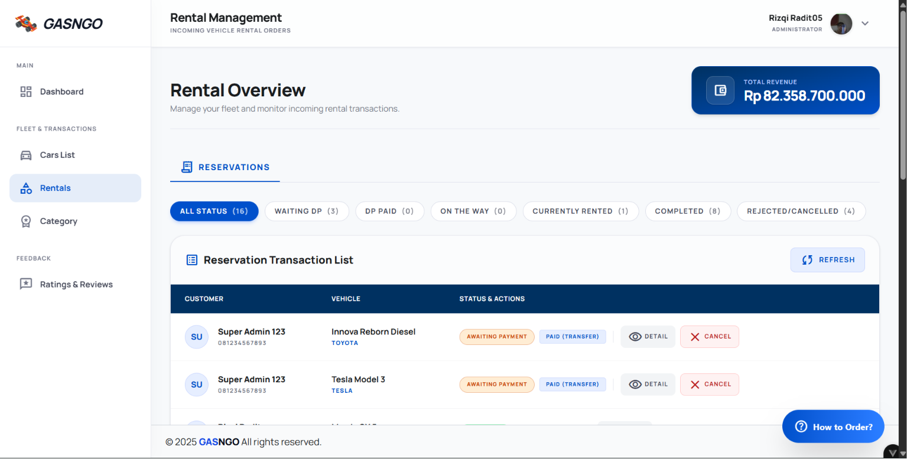
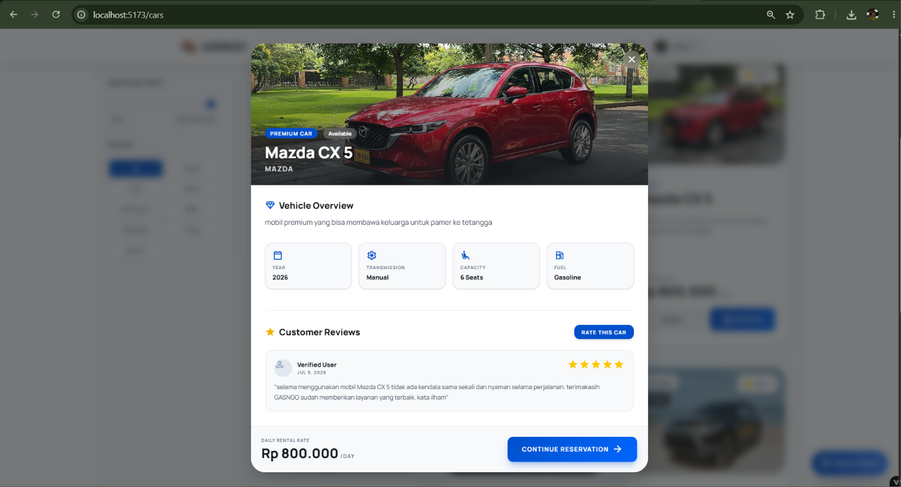
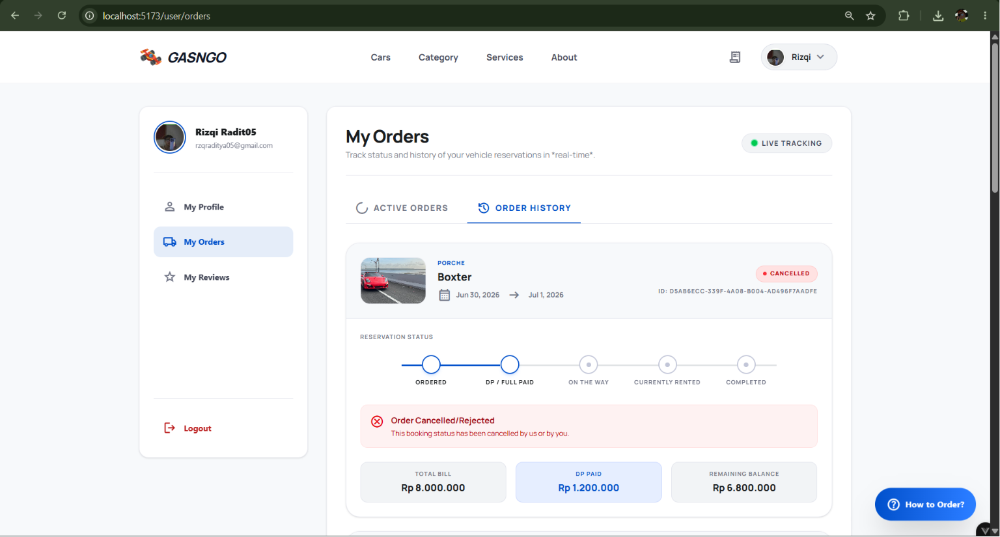

# 🚗 GASNGO - Sistem Informasi Penyewaan Mobil Berbasis Web

**GASNGO** adalah sebuah Sistem Informasi Manajemen Penyewaan Mobil Berbasis Web yang dirancang sebagai solusi digital terintegrasi untuk mengelola operasional bisnis rental kendaraan. Proyek ini dikembangkan melalui metode *Project Based Learning* (PBL) di Politeknik Negeri Bali.

Sistem ini hadir untuk memecahkan masalah operasional rental mobil konvensional seperti ketidakteraturan data, risiko *double booking*, serta lambatnya pelaporan keuangan. Dengan GASNGO, pengelolaan armada menjadi terpusat, transparan, dan dapat diakses secara *real-time*.

## ✨ Fitur Utama

Berdasarkan proposal pengembangan, sistem ini dilengkapi dengan fitur-fitur berikut:

**Untuk Pelanggan (User):**
- 🚙 **E-Katalog Kendaraan Terintegrasi:** Menampilkan unit mobil, fasilitas, harga sewa, dan status ketersediaan.
- 📅 **Sistem Reservasi Real-Time:** Memilih rentang tanggal sewa dengan filter ketersediaan otomatis untuk mencegah bentrok jadwal.
- 📄 **Unggah Dokumen Mandiri:** Fitur upload KTP/SIM langsung pada formulir pemesanan.
- 📦 **Live Tracking & Riwayat Pesanan:** Memantau status pesanan (Awaiting Payment, On the way, Currently Rented, Completed, Cancelled).

**Untuk Pengelola (Admin):**
- 📊 **Dasbor Kendali (Main Dashboard):** Menampilkan analitik total pendapatan, jumlah transaksi, armada, dan grafik *revenue stream*.
- ⚙️ **Manajemen Reservasi:** Memantau pesanan masuk, konfirmasi pembayaran (DP/Full), dan membatalkan pesanan.
- 💰 **Manajemen Pengembalian & Denda:** Perhitungan durasi sewa dan denda keterlambatan secara otomatis.

---

## 🛠️ Tech Stack

- **Frontend:** Vue.js 3 + Vite 
- **Backend:** Node.js + Express.js
- **Database:** PostgreSQL
- **Design/UI:** Clean & Mobile-friendly UI

---

## 📸 Cuplikan Layar (Screenshots)

Berikut adalah antarmuka dari aplikasi GASNGO:

### 1. Katalog Mobil (All Cars)
Pelanggan dapat melihat daftar mobil premium maupun city car, lengkap dengan filter, harga sewa harian, dan ketersediaan.


### 2. Dashboard Admin
Halaman ringkasan untuk pengelola melihat pendapatan, total transaksi, dan grafik keuangan dalam 7 hari terakhir.


### 3. Manajemen Reservasi (Admin)
Daftar seluruh transaksi pemesanan mobil beserta status pembayaran dan aksi yang dapat dilakukan admin.


### 4. Detail Kendaraan & Ulasan
Pop-up detail yang menampilkan spesifikasi lengkap kendaraan (Tahun, Transmisi, Kapasitas, Bahan Bakar) serta ulasan dari pelanggan sebelumnya.


### 5. Lacak Pesanan Pengguna (My Orders)
Halaman sisi pelanggan untuk melacak *timeline* pemesanan kendaraan, tagihan, serta status pembayaran DP/Lunas.


---

## 🚀 Persiapan & Instalasi Proyek (Project Setup)

Ikuti langkah-langkah di bawah ini untuk menginstal dan menjalankan proyek secara lokal.

### 1. Clone Repository
Buka terminal dan jalankan perintah berikut untuk mengunduh proyek:
```sh
git clone https://github.com/urmalevolent/GAS_N_GO.git
```

### 2. Setup Frontend
Masuk ke folder `frontend`, lalu instal seluruh *dependency* dan *library* tambahan (`aos`):
```sh
cd GAS_N_GO/frontend
npm install
npm install aos
```

### 3. Setup Backend
Buka terminal baru (atau tab baru), masuk ke folder `backend`, lalu instal *dependency*-nya:
```sh
cd GAS_N_GO/backend
npm install
```

### 4. Menjalankan Aplikasi
Setelah proses instalasi di kedua folder selesai, jalankan *server development* di masing-masing terminal (satu untuk frontend, satu untuk backend) dengan perintah:
```sh
npm run dev
```

---

### Recommended IDE Setup

- [VS Code](https://code.visualstudio.com/) + [Vue (Official)](https://marketplace.visualstudio.com/items?itemName=Vue.volar) (and disable Vetur).

### Recommended Browser Setup

- Chromium-based browsers (Chrome, Edge, Brave, etc.):
  - [Vue.js devtools](https://chromewebstore.google.com/detail/vuejs-devtools/nhdogjmejiglipccpnnnanhbledajbpd)
  - [Turn on Custom Object Formatter in Chrome DevTools](http://bit.ly/object-formatters)
- Firefox:
  - [Vue.js devtools](https://addons.mozilla.org/en-US/firefox/addon/vue-js-devtools/)
  - [Turn on Custom Object Formatter in Firefox DevTools](https://fxdx.dev/firefox-devtools-custom-object-formatters/)

### Customize configuration

See [Vite Configuration Reference](https://vite.dev/config/).
